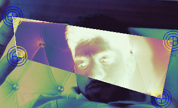
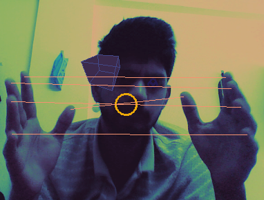
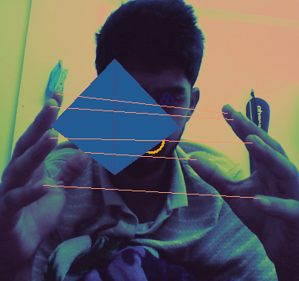

# Hand Gesture Capture

Real-time hand landmark detection and gesture-based capture using MediaPipe and OpenCV. Two apps: a lightweight inverter and a full-featured gesture interface with 3D shapes, face tracking, and Sharingan eye effects.







## Apps

### `cap0` — Hand Landmark Inverter (`app.py`)

```bash
python app.py
```

- Tracks thumb (4) and index (8) tips for both hands
- Draws blue HUD targets on fingertips
- Inverts pixels inside the polygon formed by the 4 landmarks
- White line connects both index fingertips
- **Capture**: Touch both ring fingertips (16) and hold for 5s
- **Quit**: Press `q`

### `cap1` / `cap2` — Hand Gesture Interface (`hand_gesture_app.py`)

```bash
python hand_gesture_app.py
```

- Face tracking with Sharingan eye effect (right eye only)
- 3D shape projection (Cube → Octahedron → Sphere) centered on screen
- Explode/implode particle system
- Light blue connection lines between corresponding fingertips
- **Activate Sharingan**: Touch both index fingertips and hold for 2s
- **Morph shape**: Make a fist with either hand, then release
- **Explode**: Clench both fists, then pull them apart quickly
- **Implode**: Open both hands while exploded
- **Rotate shape**: One fist + one open hand (fist hand = yaw, open hand Y = tilt)
- **Capture**: Touch both ring fingertips (16) and hold for 5s
- **Quit**: Press `q`

## Requirements

- Python 3.8+
- Webcam

## Installation

```bash
python -m venv venv
source venv/bin/activate
pip install -r requirements.txt
```

Download the MediaPipe models:

```bash
wget -q https://storage.googleapis.com/mediapipe-models/hand_landmarker/hand_landmarker/float16/1/hand_landmarker.task
wget -q https://storage.googleapis.com/mediapipe-models/face_landmarker/face_landmarker/float16/1/face_landmarker.task
```

## Project Structure

```
.
├── app.py                    # cap1 — Hand Landmark Inverter
├── hand_gesture_app.py       # cap2 — Full Gesture Interface
├── hand_landmarker.task      # MediaPipe hand model
├── face_landmarker.task      # MediaPipe face model
├── requirements.txt
└── README.md
```

## Dependencies

| Package | Purpose |
|---|---|
| opencv-python | Camera capture, image processing, drawing |
| mediapipe | Hand and face landmark detection |
| numpy | Array operations, particle physics |

## Visual Effects

- **TURBO colormap**: Thermal-style background overlay on both apps
- **Sharingan eye**: Red glow with spinning tomoe (cap2)
- **3D shapes**: Perspective-projected geometry with layered glow (cap2)
- **Particles**: Explode/implode physics with shape-colored trails (cap2)
- **Pixel inversion**: Negative effect inside hand polygon (cap1)
